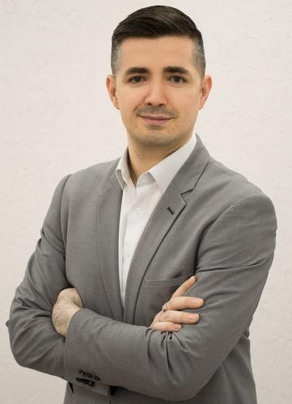

# Жучков Алексей Владимирович

**Мужчина, 41 год, родился 2 июля 1982**

## Контактная Информация
- **Телефон:** +7 (963) 9639432
- **Email:** [alexey@yandex.ru](mailto:alexey@yandex.ru) (предпочитаемый способ связи)
- **Проживает:** Тбилиси, Грузия
- **Гражданство:** Россия
- **Языки:** Русский (Родной), Английский (C1 - Продвинутый)

## Желаемая Должность
**Руководитель** - управления командами разработки 1С

### Специализации
- Программист, разработчик
- Руководитель группы разработки
- Руководитель проектов

### График Работы
- Полная занятость / Частичная занятость / проектная работа
- Удаленная работа

## Опыт Работы

### Тинькофф Банк, Москва
- **Должность:** Руководитель группы развития сервисов 1С/Проектный менеджер
- **Период:** Июль 2019 — Сентябрь 2022
- **Основные достижения:**
  - Управление проектом по бухгалтерскому обслуживанию клиентов малого и среднего бизнеса.
  - Выстроил работу команды разработки и сопровождения проекта.
  - Внедрил BI на базе ClickHouse и Metabase.
  - Осуществил переход вверенных ИС на PostgreSQL.
  - Ускорил работу ИС в сотни раз, уменьшил требования к СХД в десятки рад

### Группа компаний ПИК, Россия
- **Должность:** Архитектор 1С
- **Период:** Август 2018 — Июнь 2019
- **Основные функции:**
  - Управление командой разработки.
  - Разработка и внедрение систем мониторинга и проактивного уведомления.

### Другой Опыт
- **АйЭмТи, ООО (data центр Сибинтэк, Роснефть), Москва:** Архитектор 1С (Ноябрь 2016 — Январь 2018)
- **ИТМ, ООО (сеть магазинов "Магнит"), Краснодар:** Ведущий специалист сектора поддержки сервисов 1С (Июль 2011 — Октябрь 2016)

## Образование
**Санкт-Петербургский Государственный Инженерно-Экономический Университет**
- **Специальность:** Информационные системы в экономике, экономист
- **Год окончания:** 2004

## Ключевые Навыки
- Разработка на 1С, Python, SQL
- Генеративные сети 4-го поколения
- Управление проектами и командами
- Администрирование ОС и ИС на базе Linux и Windows

## Дополнительная Информация
- Автор экспертных статей по улучшению работы 1С на сайте Инфостарт.
- Спикер Infostart 2021
- Эффективно управляю командой и мотивирую сотрудников.
- Могу организовать не только своё время.

## Ссылки
- [Профиль на Инфостарт](http://infostart.ru/profile/232316/public/)
